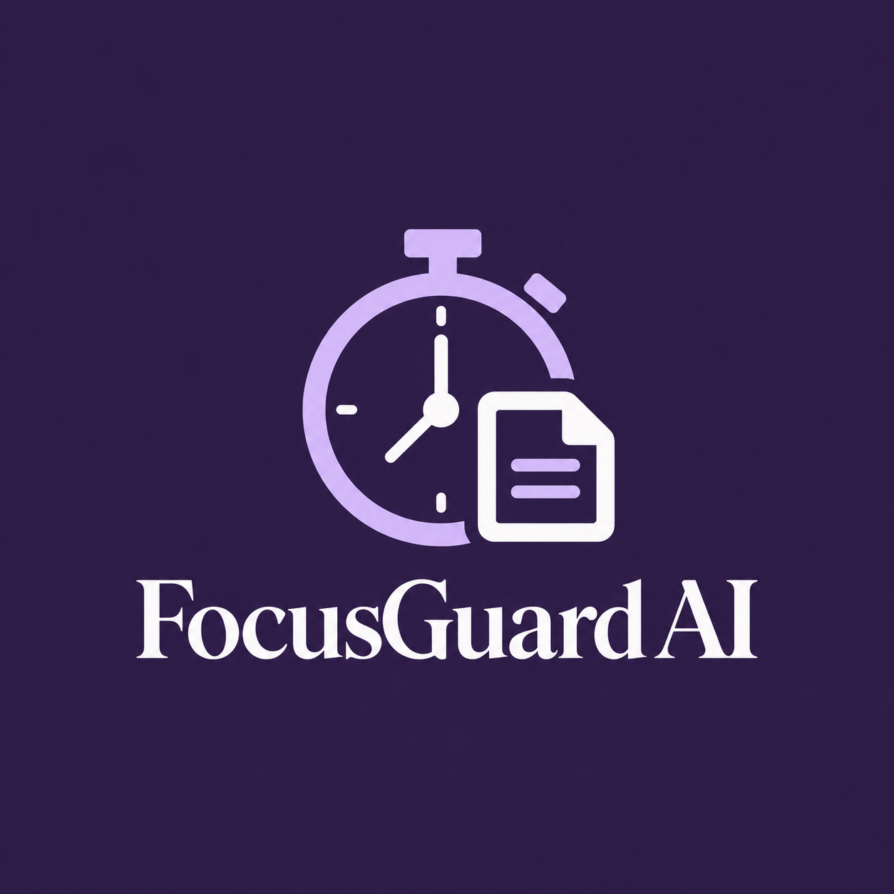

<p align="center">
  
</p>

<h1 align="center">FocusGuard AI</h1>

<p align="center">
  <b>See where your attention really goes, and build better focus habits.</b><br>
  AI-powered digital attention management · Infosys Springboard Internship 2026 · Aishee Mukherjee
</p>

<p align="center">
  <a href="https://focusguard-ai-y4tt.onrender.com"><b>▶ Open the app</b></a> &nbsp;·&nbsp;
  <a href="https://github.com/aisheeem7/focusguard-ai/releases/latest"><b>⬇ Downloads</b></a> &nbsp;·&nbsp;
  <a href="#-for-developers-run-it-from-the-code">🛠 Run the code</a>
</p>

---

FocusGuard AI quietly tracks which **apps and browser tabs** you use, works out whether each one is **productive**, **distracting** or **neutral**, and turns that into a dashboard that helps you stay focused: Focus Mode timers, streaks, badges, a leaderboard with friends and a weekly AI-written insight.

## 🚀 Start using it (no installation needed)

1. Open **[focusguard-ai-y4tt.onrender.com](https://focusguard-ai-y4tt.onrender.com)**.
2. Click **Start Focusing** and create an account (just a username and password, no email).
3. You're in. Explore the dashboard, start a Focus Mode session, or create a study group.

**Want it as an app on your computer?** In Chrome or Edge, click the **install icon** at the right end of the address bar. FocusGuard then opens in its own window, like any other app.

> The app runs on a free server that sleeps when nobody is using it, so the very first visit can take up to a minute.

## 📥 Turn on automatic tracking (optional)

The website shows your data. To **collect** it automatically, add one or both trackers from the **[Downloads page](https://github.com/aisheeem7/focusguard-ai/releases/latest)**:

### Browser extension: tracks your tabs (Chrome, Edge, Brave)
1. Download **`FocusGuard-extension.zip`** and **unzip** it into a folder you'll keep.
2. Open `chrome://extensions` (or `edge://extensions`) and switch on **Developer mode** (top-right).
3. Click **Load unpacked** and choose the unzipped folder.
4. Click the FocusGuard icon in your toolbar and sign in under **Account** with your FocusGuard username and password.

### Desktop tracker: tracks your apps (Windows)
1. Download **`FocusGuard-Tracker.exe`** and double-click it.
2. If Windows shows *"Windows protected your PC"*, click **More info → Run anyway**. This appears because the app isn't code-signed, not because anything is wrong.
3. Sign in once in the window that opens. It remembers you next time.

Use the **same account** everywhere, and your tabs and apps appear together on one dashboard.

## 🧭 How to use it

| Page | What you do there |
|---|---|
| **Overview** | Your last 7 days at a glance, plus a 6-month activity grid (like GitHub's) |
| **Focus Mode** | Pick a length and start. Stay off distractions or the session breaks; take a break any time. There's also a full-screen timer. |
| **Streaks** | Days with few distracting switches build your streak |
| **Badges** | 15 achievements to unlock, from *First Spark* to *Centurion* |
| **Leaderboard** | Create a group, share its join code with friends, and compare weekly focus scores |
| **Insights** | A short AI summary of your week with one practical tip |
| **History** | Your top apps and tabs, your biggest distraction and your best day |

Your profile photo, language (English, हिन्दी, বাংলা, தமிழ், मराठी) and light/dark theme are in the top-right corner.

## ✨ Features

- **Automatic tracking** of desktop apps and browser tabs, merged into one timeline with no double counting.
- **Smart classification:** a curated list of apps and sites first, then title keywords (so a *lecture* on YouTube counts as productive and a *music video* as a distraction), then AI.
- **Focus Mode:** a countdown with a grace period for brief slips, breaks with fair penalties, and alerts if you drift.
- **Motivation:** streaks, 15 badges, a GitHub-style activity grid and group leaderboards.
- **AI insights:** a weekly summary that names your biggest distraction and suggests a fix. It's written from your stats if no AI service is available.
- **Alerts:** desktop and browser notifications for distractions, Focus Mode warnings and break reminders.
- **Made for everyone:** 5 languages, light and dark themes, works on phones, installable as an app.
- **Private by design when self-hosted:** run it on your own computer and your activity data stays there. Only optional AI classification and insight requests go out.

## ⚠️ Limitations

- **The desktop tracker download is for Windows only.** Mac and Linux users can use the website and the extension, or run the tracker from source code (see below).
- **The extension works in Chromium browsers** (Chrome, Edge, Brave). It isn't available for Firefox or Safari, and isn't in the Chrome Web Store yet, hence the "Load unpacked" steps.
- **Phones:** the website works on mobile, but phone activity isn't tracked.
- **The free server sleeps** when idle, so the first visit after a quiet spell is slow.
- **Classification isn't perfect.** Unusual apps or vague page titles may be marked neutral or mislabelled.
- **The online version stores your activity** (app names and page titles) on its server so the dashboard can show it. If you'd rather keep everything on your own computer, run it locally (below).
- **Translations** were machine-assisted and haven't been reviewed by native speakers.

---

## 🛠 For developers: run it from the code

### What you need
- **Python 3.11+**
- **Node.js 20.19+** (builds the website on first run)
- **Git**, and Chrome/Edge/Brave for the extension

### 1. Clone and install
```bash
git clone https://github.com/aisheeem7/focusguard-ai.git
cd focusguard-ai

python -m venv venv
venv\Scripts\activate            # Windows   (macOS/Linux: source venv/bin/activate)

pip install -r requirements.txt -r backend/requirements.txt
pip install pywin32 psutil plyer                   # Windows tracker
# macOS: pip install pyobjc-framework-Cocoa psutil plyer
# Linux (X11): sudo apt-get install xdotool wmctrl && pip install psutil plyer
```

### 2. (Optional) Add AI keys
Create a file named `.env` in the project folder. Any one key is enough, and without one, insights are written from your stats instead.
```
GEMINI_API_KEY=...            # free at aistudio.google.com
ANTHROPIC_API_KEY=...
CHEAPER_INFERENCE_API_KEY=...
```

### 3. Run everything with one command
```bash
python launch_focusguard.py
```
On the first run, this builds the website, then starts the backend and the desktop tracker and opens **http://127.0.0.1:8000**. Create an account and start using it. The tracker signs in automatically with whatever account you're signed into on the dashboard.

Options: `--no-tracker` (website only), `--no-build` (skip the build check), `--port 8001`.

### 4. Load the extension (local version)
`chrome://extensions` → **Developer mode** → **Load unpacked** → select the **`extension-patch/`** folder. It connects to your dashboard account by itself.

> This folder talks to the local server (`127.0.0.1:8000`). The extension in the Downloads zip talks to the online site. Load only one at a time.

### Tests
```bash
python -m pytest backend/tests -q
```
52 automated tests cover accounts, tracking, classification, streaks, badges, groups, Focus Mode, insights, history and online mode. To run the same tests against PostgreSQL, add `TEST_DATABASE_URL=postgresql://...`.

### Deploy your own copy
To host your own online version (Render + Neon, both free) and build the Windows tracker and extension downloads, follow **[DEPLOY.md](DEPLOY.md)**.

### How it fits together
```
   Desktop apps                    Browser tabs
        │                               │
  window_tracker.py              Chrome extension
        └──────────────┬────────────────┘
                       ▼
        Backend: FastAPI + SQLite / PostgreSQL
        (accounts, classification, insights, serves the website)
                       │
                       ▼
             Web dashboard + installable app
```

### Project structure
```
├── launch_focusguard.py      one command to run everything locally
├── window_tracker.py         desktop tracker (Windows / macOS / Linux X11)
├── backend_client.py         tracker ↔ backend connection
├── notifier.py               desktop notifications
├── llm_classifier.py         tracker's direct AI fallback
├── app_categories.json       productive / distraction / neutral lists (shared with the backend)
├── reset_password.py         local password reset utility
├── demo_features.py          prints each feature's output, for demos
├── backend/                  FastAPI app: main.py, models, schemas, auth, tests/
├── extension-patch/          Chrome extension (background.js, popup, manifest)
├── frontend/                 main dashboard: app.html, js/, css/, locales/ (5 languages)
├── frontend-react/           landing, sign-in and profile pages (React) + website build
├── scripts/build_release.py  builds the tracker .exe and extension .zip for a deployed site
├── Dockerfile, render.yaml   online deployment (see DEPLOY.md)
└── logo.png                  app icon
```

**Tech stack:** Python · FastAPI · SQLAlchemy · SQLite / PostgreSQL · React + TypeScript + Vite · vanilla JS dashboard · Chrome Extension (Manifest V3) · PyInstaller · Docker · Gemini / Claude for insights.

---

## 📄 License

FocusGuard AI is released under the **[MIT License](LICENSE)**. You're free to use, modify and share it, including commercially, as long as the copyright notice is kept.

Third-party material is not covered by this license: the background video (loaded from an external host), Google Fonts (Inter, Instrument Serif; SIL Open Font License) and the open-source libraries listed in `requirements.txt` and `package.json`, which keep their own licenses.

<p align="center">୨ৎ made with ♡ by ash ୨ৎ</p>
